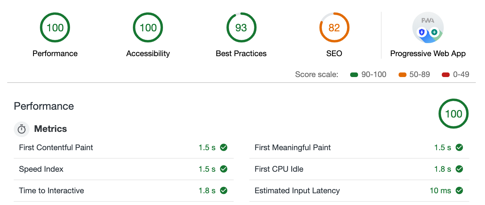

# react-pwa-starter-typescript

This is a dead simple yet feature filled starter pack for building PWA ready React Applications.
demo: https://chin2km.github.io/react-pwa-starter-typescript/

## Current lighthouse scores:



## Features
✅ react
✅ PWA ready
✅ webpack bundling
✅ babel transpiler
✅ webpack-dev-server

## TODOs
❌ typescript
❌ eslint
❌ prettier

> available commands

```
install packages: $ npm install

start dev-server: $ npm run dev

start build: $ npm run build
```
